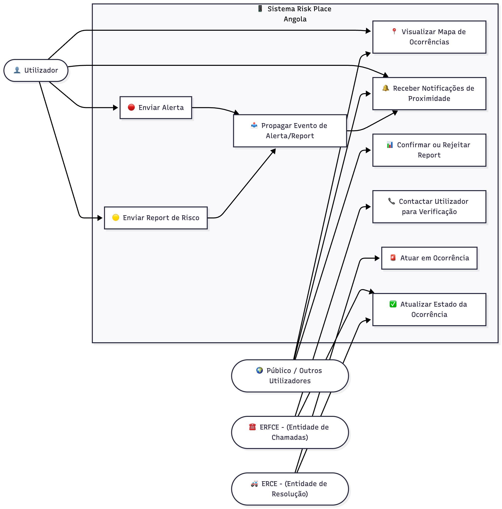

# Risk Place Angola

**Risk Place Angola (RPA)** é uma plataforma **open-source** criada para **mapear, monitorar e reportar locais de risco em Angola**, conectando cidadãos, entidades de emergência e comunidades locais em uma rede de **colaboração e resposta rápida**.

O sistema tem como **propósito salvar vidas**, ao facilitar **alertas automáticos, notificações de risco georreferenciadas e apoio às entidades de resposta rápida**.

Mais do que uma tecnologia, a RPA é uma **ponte entre as pessoas** — uma forma de criar solidariedade digital e segurança colaborativa.

## 💡 Missão

Permitir que **qualquer pessoa**, em **qualquer lugar**, possa **alertar situações de risco em tempo real**, e que as **entidades responsáveis** possam **intervir rapidamente**, reduzindo perdas humanas e materiais.

## 🧭 Visão Geral

A RPA atua como um **elo de comunicação e cooperação** entre:

* 👤 **Usuários** em situações de risco;
* ☎️ **ERFCE** — *Entidades Responsáveis por Fazer Chamadas de Emergência*;
* 🚑 **ERCE** — *Entidades Responsáveis por Resolver Chamadas de Emergência*.

O sistema utiliza **geolocalização em tempo real**, **alertas por botão físico ou digital**, e **notificações automáticas**, promovendo uma **resposta coordenada e imediata** em situações de emergência.

## 🔠 Significado das Siglas

| Sigla     | Significado                                              | Função Principal                                                                                     |
| --------- | -------------------------------------------------------- | ---------------------------------------------------------------------------------------------------- |
| **ERFCE** | Entidade Responsável por Fazer Chamadas de Emergência    | Recebe alertas e contacta o utilizador; pode confirmar ou encaminhar para a ERCE.                    |
| **ERCE**  | Entidade Responsável por Resolver Chamadas de Emergência | Atua diretamente na resolução (Polícia, Bombeiros, Hospitais, Proteção Civil, etc.).                 |
| **RPA**   | Risk Place Angola                                        | Plataforma que conecta cidadãos e entidades de resposta, criando uma rede de segurança colaborativa. |

## ⚙️ Como Funciona

O sistema possui **duas funcionalidades principais**: **🔴 Alert** e **🟡 Report** — ambas visíveis e acessíveis no **mapa interativo**, que é o centro da experiência do utilizador.

---

### 🔴 Alert – Situações de Emergência (Fluxo Institucional)

1. O **usuário (U)** aciona o botão de alerta no aplicativo (ou em um dispositivo físico).
2. Após **5 segundos pressionando**, o sistema:

   * Envia automaticamente a **localização GPS**, **identificação** e **tipo de emergência**.
   * Notifica **imediatamente** tanto a **ERFCE** quanto a **ERCE** mais próxima.
3. O **ERCE** recebe a notificação **em tempo real**, podendo agir **mesmo sem confirmação prévia** do ERFCE.
4. O **ERFCE** atua em paralelo, **contactando o utilizador** e **atualizando o estado** da ocorrência (ex.: “confirmada”, “em atendimento”, “resolvida”).
5. O ciclo é monitorizado no **mapa central**, com indicadores visuais (vermelho piscante para emergências ativas).

🔒 Alguns alertas **não são exibidos publicamente**, por motivos de segurança e privacidade (ex.: violência doméstica, sequestros, situações pessoais).

🌍 Já **alertas públicos** (ex.: acidente de via, incêndio, desabamento) podem ser **visíveis e colaborativos**, permitindo que a comunidade visualize e evite a área afetada.

---

### 🟡 Report – Locais de Risco (Colaboração Pública)

1. Qualquer utilizador pode **reportar locais de risco** (ruas escuras, buracos, zonas de assalto, lixo acumulado, incêndios pequenos, etc.).
2. Esses reports aparecem no **mapa colaborativo**, visíveis a todos os utilizadores próximos.
3. Outros utilizadores podem:

   * Confirmar o risco ("👍 Confirmar risco").
   * Comentar ou adicionar informação adicional.
4. O sistema usa **validação comunitária**:

   * Reports **confirmados** ganham maior visibilidade.
   * Reports **antigos ou não confirmados** são rebaixados ou arquivados.
5. A RPA gera um **histórico de riscos** que apoia **políticas públicas, planeamento urbano e prevenção comunitária**.

## 🎯 Objetivos

### Objetivo Geral

Construir uma **rede colaborativa de segurança pública**, unindo cidadãos e entidades de emergência na **resposta rápida e preventiva**.

### Objetivos Específicos

* Mapear e classificar **locais e situações de risco** em tempo real.
* Reduzir o **tempo de resposta** das entidades de emergência.
* Fornecer **dados abertos** para políticas públicas.
* Promover uma **cultura digital de solidariedade e prevenção**.

## Impacto

A RPA tem impacto direto na segurança pública e proteção civil, permitindo:

* Identificação precoce de **zonas perigosas**.
* **Coordenação imediata** entre cidadãos e autoridades.
* **Redução de vítimas** e incidentes por falta de aviso.
* Criação de uma **rede de vigilância ativa** e participativa.

## Público Alvo

* Cidadãos e comunidades locais.
* Polícia, bombeiros, hospitais e proteção civil.
* Municípios e ONGs ligadas à gestão de risco.
* Universidades, pesquisadores e desenvolvedores interessados em **soluções open-source para cidades seguras**.

## 🧩 Análise do Sistema

### ⚙️ Requisitos Funcionais

| ID       | Descrição                                                                                                                                                        | Prioridade |
| -------- | ---------------------------------------------------------------------------------------------------------------------------------------------------------------- | ---------- |
| **RF01** | A plataforma deve possuir um **botão de alerta** para que os usuários possam acioná-lo em caso de emergência.                                                    | Essencial  |
| **RF02** | A plataforma deve **monitorar o botão de alerta** e, ao fim de **5 segundos contínuos pressionado**, enviar **notificação e localização GPS** à ERCE e ERFCE.    | Essencial  |
| **RF03** | A plataforma deve permitir um **modo alternativo de alerta**, enviando notificação e localização **após 5 toques consecutivos** no botão de alerta.              | Essencial  |
| **RF04** | Ao pressionar o botão de alerta, a plataforma deve **ativar automaticamente a geolocalização** do dispositivo, caso esteja desativada.                           | Essencial  |
| **RF05** | A plataforma deve permitir que **usuários e entidades** visualizem **locais de risco e ocorrências** num **mapa interativo em tempo real**.                      | Essencial  |
| **RF06** | A plataforma deve permitir que as **entidades responsáveis (ERCE e ERFCE)** visualizem a **localização precisa e movimento** do utilizador que acionou o alerta. | Essencial  |
| **RF07** | A plataforma deve permitir que **qualquer utilizador** reporte **locais de risco** (🟡 Report), visíveis publicamente no mapa.                                   | Importante |
| **RF08** | A plataforma deve permitir que **outros usuários confirmem** ou **comentem reports existentes**, reforçando a validação comunitária.                             | Importante |
| **RF09** | O sistema deve **notificar automaticamente** os utilizadores próximos de **novos alertas (🔴)** e **reports (🟡)** relevantes.                                   | Essencial  |
| **RF10** | A plataforma deve permitir que a **ERCE** atualize o **estado da ocorrência** (pendente, em atendimento, resolvida).                                             | Importante |
| **RF11** | A plataforma deve **registrar logs e históricos** de alertas e reports, para consulta e análise posterior.                                                       | Importante |
| **RF12** | O sistema deve permitir **autenticação de utilizadores e entidades**, com **diferentes papéis** (Usuário, ERFCE, ERCE).                                          | Essencial  |
| **RF13** | O sistema deve oferecer uma **interface de painel** para que a **ERFCE** e a **ERCE** monitorem, filtrem e analisem ocorrências.                                 | Importante |

---

### 🧱 Requisitos Não Funcionais

| ID        | Descrição                                                                                                                                          | Prioridade |
| --------- | -------------------------------------------------------------------------------------------------------------------------------------------------- | ---------- |
| **RNF01** | A plataforma deve ser **intuitiva e fácil de usar**, garantindo que o botão de alerta possa ser acionado rapidamente em situação de emergência.    | Importante |
| **RNF02** | A plataforma deve ser **confiável** e **operar corretamente** em todos os momentos, sem falhas críticas durante emergências.                       | Importante |
| **RNF03** | O sistema deve estar **disponível 24/7**, garantindo funcionamento contínuo, mesmo em horários de alta demanda.                                    | Importante |
| **RNF04** | O sistema deve ter **baixo tempo de resposta**, enviando alertas e atualizações em **menos de 2 segundos** após acionamento.                       | Importante |
| **RNF05** | O sistema deve **suportar alto volume de dados e acessos simultâneos** (centenas de notificações por minuto).                                      | Importante |
| **RNF06** | O projeto deve ser **open-source**, permitindo contribuições da comunidade e auditoria pública do código.                                          | Importante |
| **RNF07** | A plataforma deve ser **compatível com dispositivos móveis e desktop**, com **design responsivo** adaptável a diferentes tamanhos de ecrã.         | Importante |
| **RNF08** | A comunicação entre o aplicativo e o servidor deve ser **segura (HTTPS + Criptografia TLS)**, garantindo a privacidade dos dados dos utilizadores. | Essencial  |
| **RNF09** | O sistema deve ter **registro e monitoramento de erros**, garantindo **observabilidade e manutenção eficiente**.                                   | Importante |
| **RNF10** | A infraestrutura deve permitir **escalabilidade horizontal** (novos nós/instâncias) sem interrupção do serviço.                                    | Importante |

---

&nbsp;

## Diagrama de Casos de Uso

 

## 🚀 MVP – Produto Mínimo Viável

1. **Mapa interativo** com alertas (vermelhos) e reports (amarelos).
2. **Botão de alerta digital** com envio automático de localização.
3. **Notificação em tempo real** para ERCE e ERFCE.
4. **Painel institucional** para monitoramento de ocorrências.
5. **Sistema de reports comunitários** com confirmações e comentários.
6. **Autenticação e papéis** (Usuário, ERFCE, ERCE).

&nbsp;

## 👥 Comunidade

💬 **Junte-se à comunidade do Risk Place Angola no [Discord](https://discord.gg/qvTzECSZch)**
Contribua, reporte bugs, proponha melhorias e ajude-nos a construir uma **rede de segurança comunitária open-source.**

---

&nbsp;

## Projeto

Para mais informações sobre o projeto, acesse o repositório do projeto no GitHub:

Backend: https://github.com/risk-place-angola/backend-risk-place

Mobile: https://github.com/risk-place-angola/mobile-risk-place

Frontend: https://github.com/risk-place-angola/frontend-risk-place
