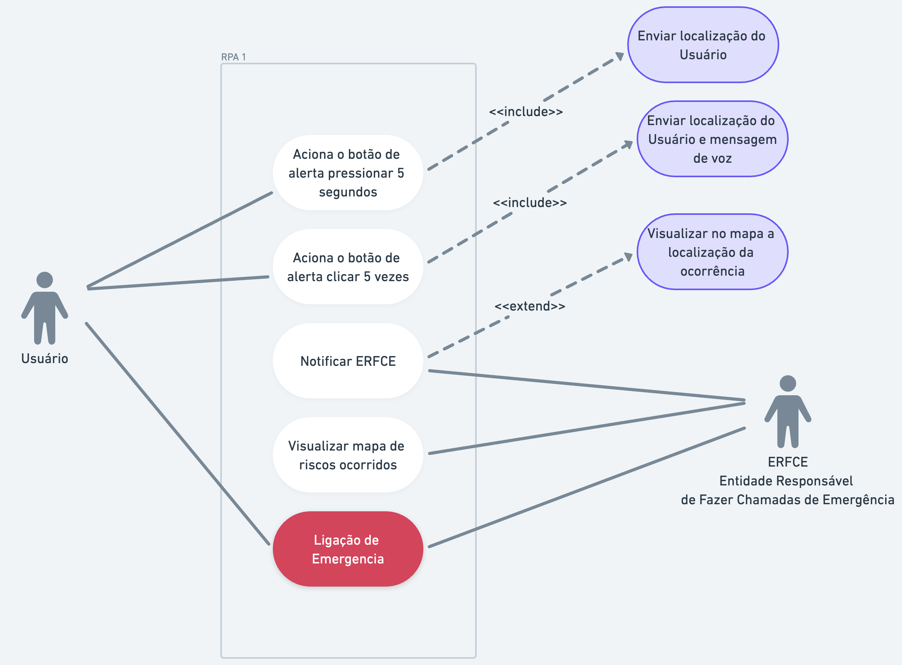

# Risk Place Angola

É uma plataforma (open-source) para mapear (ou reportar) locais de riscos.

Risk Place Angola visa facilitar a chamada de emergência e reportar locais de risco.

### 👋 Significado das siglas

**ERFCE** - Entidade Responsável por Fazer Chamadas de Emergência

**ERCE** - Entidade Responsável por Resolver Chamadas de Emergência

**RPA** - Risk Place Angola

### 🤔 Como funciona?

O Botão de alerta quando acionado, fará automaticamente uma ligação notificando a Entidade Responsável por Fazer as Chamadas de Emergência (**ERFCE**) seguindo a localização de onde o botão foi acionado ou seja, a localização do Usuário (**U**).

O **Usuário** aciona o botão de alerta, o sistema fará uma ligação para o **ERFCE**, notificando que o **Usuário** está em perigo e precisa de ajuda.

Quando o **Usuário** pressionar o botão de alerta é enviado a sua localização para o **ERFCE** Entidade Responsável por fazer as Chamadas de Emergência.

O **Usuário** terá que pressionar o botão de alerta por 5 segundos para que o sistema faça a ligação para o **ERFCE**.

Caso **Usuário** clicque no botão de alerta por 5 vezes seguidas, poderá enviar uma mensagem de voz para o **ERFCE**.

**ERFCE** - Entidade Responsável por Fazer Chamadas de Emergência

A Entidade Responsável por Fazer Chamadas de Emergência terá acesso a Plataforma
simples onde verá a localização em tempo real do **Usuário** que acionou o botão de alerta.

Com as notificações recebidas no sistema, o **ERFCE** terá que ligar para o **Usuário** para saber o que está acontecendo e se o **Usuário** está em perigo.

A partir deste meio de comunicação, o **ERFCE** poderá tomar as devidas providências para resolver o problema.

**ERCE** - Entidade Responsável por Resolver Chamadas de Emergência

As Entidades Responsáveis de Resolverem as Chamadas de Emergências são: - Polícia; - Bombeiros; - Serviços de saúde (Hospitais, Clínicas, etc); - Protecção Civil; - Outras entidades.

Entidade Responsável por Resolver Chamadas de Emergência terá acesso a Plataforma simples onde verá a localização em tempo real do **Usuário** que acionou o botão de alerta.

## Objetivos

O objetivo da Plataforma é prevenir acidentes, crimes e outros incidentes que possam colocar a vida das pessoas em perigo.

### Objetivo Geral

O objetivo principal da plataforma é de permitir que mais pessoas tenham conhecimentos de locais de riscos e alertar quando ocorrer algum incidente.

A Plataforma tem como objetivo alertar incidentes e reportar os lugares de riscos e consequentemente ajudar na resolução desses mesmos problemas por parte das entidades responsáveis, que puderam tomar conhecimento a partir da plataforma.

## Impacto

A Plataforma tem impacto social, a mesma visa prevenir as pessoas de riscos que atentam à vida.

## Público Alvo

O público-alvo é qualquer pessoa que queira se manter informada protegida e informar em relação aos riscos que ocorrem em sua localidade.

 
 

---

## **Análise do Sistema**

&nbsp;

## Requisitos de Software

&nbsp;

### Requisitos Funcionais

|  ID  | Descrição                                                                                                                                       | Prioridade |
| :--: | ----------------------------------------------------------------------------------------------------------------------------------------------- | :--------: |
| RF01 | A plataforma deve posuir um botão de alerta para que os usuários possam acioná-lo em caso de emergência.                                        | Essencial  |
| RF02 | A plataforma deve monitorar o botão de alerta e ao fim de 5 segundos contínuos pressionado deve enviar a notifição e a localização.             | Essencial  |
| RF03 | A plataforma deve monitorar os clicks no botão de alerta e ao fim de 5 clicks enviar uma notificação de áudio e a localização.                  | Essencial  |
| RF04 | A plataforma deve Permitir que ao pressionar o botão de Alerta deve ligar localização do dispositivo.                                           | Essencial  |
| RF05 | A plataforma deve permitir que usuários e entidades responsáveis visualizem locais de risco em um mapa.                                         | Essencial  |
| RF06 | A plataforma deve permitir que as entidades responsáveis visualizem a localização de quem precionou o botão de alerta em um mapa em tempo real. | Essencial  |
|      |                                                                                                                                                 |            |

&nbsp;
&nbsp;

### Requisitos Não Funcionais

|  ID   | Descrição                                                                                                                                                                                            | Prioridade |
| :---: | ---------------------------------------------------------------------------------------------------------------------------------------------------------------------------------------------------- | :--------: |
| RNF01 | A plataforma deve ser intuitiva e fácil de usar para que os usuários possam acionar o botão de alerta rapidamente em caso de emergência.                                                             | Importante |
| RNF02 | A plataforma deve ser confiável e funcionar corretamente em todos os momentos, garantindo que os usuários possam receber alertas e acionar o botão de alerta quando necessário.                      | Importante |
| RNF03 | A plataforma deve estar disponível para uso a qualquer momento, garantindo que os usuários possam acionar o botão de alerta em caso de emergência, mesmo em situações de alta demanda.               | Importante |
| RNF04 | A plataforma deve ter bom desempenho e velocidade de resposta, garantindo que os alertas sejam enviados e as ligações de emergência sejam realizadas rapidamente.                                    | Importante |
| RNF05 | A plataforma deve ser capaz de lidar com grandes volumes de dados sem falhas ou interrupções no serviço e acessos simultâneos.                                                                       | Importante |
| RNF06 | A plataforme deve ser desenvolvido em uma plataforma open-source, permitindo contribuições da comunidade de desenvolvedores                                                                          | Importante |
| RNF07 | A plataforma deve ser compatível com os ecrãs dos diferentes dispositivos móveis, sendo responsivo, se adaptando funcionando em dispositivos móveis e desktop com os seus variados tamanhos de tela. | Importante |
|       |                                                                                                                                                                                                      |            |

&nbsp;
&nbsp;
&nbsp;

## Diagrama de Casos de Uso

 
 

## MVP - Produto Mínimo Viável

- [ ] Um botão de alerta para que os usuários possam acioná-lo em caso de emergência.
- [ ] Ao fim de 5 segundos pressionando o botão de alerta a plataforma deve enviar a notifição e a localização.
- [ ] Ao fim de 5 clicks no botão de alerta a plataforma deve enviar uma notificação de áudio e a localização.
- [ ] Uma interface simples para que as entidades responsáveis possam ver as notificações de emergência recebidas e as localizações dos usuários que as enviaram.
- [ ] Um mapa interativo que mostra locais de risco conhecidos na área.

> Usuário (U) -> Botão de alerta -> Ligação de emergência <-> Entidade Responsável de fazer as Chamadas de Emergência (ERFCE) -> Mapa de ocorrências -> Usuário (U);

&nbsp;

## 👥 Comunidade

Junte-se a comunidade do Risk Place Angola no Discord
[Clicando Aqui](https://discord.gg/qvTzECSZch)

---

&nbsp;

## Projeto

Para mais informações sobre o projeto, acesse o repositório do projeto no GitHub:

Backend: https://github.com/risk-place-angola/backend-risk-place

Mobile: https://github.com/risk-place-angola/mobile-risk-place

Frontend: https://github.com/risk-place-angola/frontend-risk-place
