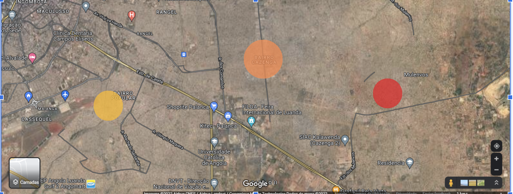

# Risk Place Angola

É uma plataforma (open-source) para mapear (ou reportar) locais de riscos.

Como: 
- Áreas de muita criminalidade;
- Locais com valas, buracos;
- Áreas com elevado número de doenças ou pandemia.

## Objetivos

### Objetivo Geral

O objetivo principal é permitir com que mais pessoas tenham conhecimentos de locais de riscos, deste modo puderam se prevenir.

A Plataforma tem como objetivo mostrar os lugares de riscos que serão reportados pelas pessoas e como consequentemente a resolução desses mesmos problemas por parte das entidades responsáveis, que puderam tomar conhecimento a partir da aplicação.

A Plataforma emitirá um “SOS” alertas de riscos no local em que a pessoa se encontra.

### Objetivo Específico

- Permitir que as pessoas recebam alerta quando se encontram em uma localização de risco;

- Permitir que as pessoas reportem locais de riscos;

- Permitir que as pessoas visualizem locais de riscos;

## Funcionamento

## Impacto

A Plataforma tem impacto social, visa prevenir as pessoas de riscos que atentam à vida.

## Público Alvo

O público alvo é qualquer pessoa que utilize a plataforma para visualizar, reportar ou receber alertas sobre locais de risco.

 
 

---

## **Análise do Sistema**

&nbsp;

## Requisitos de Software
&nbsp;

### Requisitos Funcionais

| ID | Descrição | Prioridade |
|:---:|------|:---:|
| RF01  |  Permitir que as pessoas recebam alerta quando se encontram em uma localização de risco.    | Essencial |
| RF02 |  Permitir que os usuários reportem locais de risco, fornecendo informações detalhadas sobre o local    |  Essencial |
| RF03  |   O sistema deve permitir que o usuário receba alertas quando estiver próximo de um local de risco   | Essencial |
| RF04 |   O sistema deve permitir que o usuário selecione um local de risco para visualizar as informações detalhadas   | Essencial |
| RF05 |   O sistema deve salvar as informações do local de risco reportado pelo usuário no banco de dados   | Essencial |
| RF06 |   Permitir que os usuários avaliem a segurança de um local   | Essencial |
|   |      |   |

&nbsp;
&nbsp;

### Requisitos Não Funcionais

| ID | Descrição | Prioridade |
|:---:|------|:---:|
| RNF01 |   A sistema deve ser de fácil utilização e de fácil acesso para os usuários, com uma interface simples e intuitiva.   |Importante |
| RNF02 |   A sistema deve ser capaz de lidar com grandes volumes de dados sem falhas ou interrupções no serviço e acessos simultâneos.    | Importante |
| RNF03 |   O sistema deve ser rápido e eficiente, apresentando resultados em tempo real.    | Importante |
| RNF04  |  O sistema deve ser desenvolvido utilizando a linguagem de programação Golang.    | Importante |
| RNF05 |  O sistema deve ser desenvolvido utilizando o framework web Gin.    | Importante |
| RNF06  |   O sistema deve ser desenvolvido utilizando o framework web React.js   | Importante |
| RNF07 |   O sistema deve ser desenvolvido utilizando o banco de dados PostgreSQL   | Importante |
| RNF08 |   O sistema deve ser desenvolvido em uma plataforma open-source, permitindo contribuições da comunidade de desenvolvedore   | Importante |
| RNF09 |   A sistema deve ser compatível com diferentes dispositivos móveis, responsivo funcionando em dispositivos móveis e desktop   | Importante |
| RNF10 |   A plataforma deve ser segura e garantir a privacidade dos usuários.   | Importante |
|  |      |  |

&nbsp;
&nbsp;

## Processo de Negócio

&nbsp;

**Reportar local de risco**

O usuário acessa a plataforma, seleciona a opção de reportar local de risco, preenche as informações necessárias sobre o local (descrição, tipo de risco, localização, etc.) e envia a solicitação. O sistema registra o relato e encaminha para análise da entidade responsável pela solução do problema.

**Visualizar locais de risco**

O usuário acessa a plataforma, seleciona a opção de visualizar locais de risco e informa a localização desejada. O sistema exibe os locais de risco próximos a essa localização.

**Receber alerta de risco**

O usuário acessa a plataforma, ativa a opção de receber alertas de risco e informa sua localização atual. O sistema monitora a localização do usuário em tempo real e emite alertas quando o usuário se aproxima de locais de risco reportados na plataforma.

&nbsp;
&nbsp;
&nbsp;
&nbsp;

## Diagrama de Casos de Uso

Diagrama de Caso de Uso - Risk Place Angola

O diagrama de caso de uso a seguir descreve as funcionalidades da plataforma Risk Place Angola:

Diagrama de Caso de Uso - Risk Place Angola

## Atores

**Usuário**: Qualquer pessoa que utilize a plataforma para visualizar, reportar ou receber alertas sobre locais de risco.

## Casos de Uso

**Visualizar locais de riscos**: O usuário pode visualizar locais de riscos reportados por outros usuários na plataforma.

**Reportar local de risco**: O usuário pode reportar um local de risco, indicando o tipo de risco presente no local.

**Receber alerta de local de risco**: A plataforma emite um alerta de "SOS" quando o usuário se encontra em um local de risco.
Gerenciar locais de risco reportados: As entidades responsáveis podem visualizar e gerenciar os locais de risco reportados pelos usuários na plataforma.

## Fluxo de Eventos
**Visualizar locais de riscos**

1. O usuário acessa a plataforma Risk Place Angola.

2. O sistema exibe a lista de locais de risco no mapa.

3. A plataforma exibe uma lista de locais de riscos reportados por outros usuários.

4. O usuário seleciona um local de risco.

5. O sistema exibe detalhes sobre o local de risco selecionado.

**Reportar local de risco**

1. O usuário acessa a plataforma Risk Place Angola.

2. O usuário seleciona a opção de reportar um local de risco.

3. O sistema exibe o formulário para o usuário preencher informações sobre o local de risco.

4. O usuário informa o tipo de risco presente no local (crime, buraco, doença, etc.).

5. O usuário informa a localização do risco (através de coordenadas GPS ou endereço).

6. O usuário confirma o envio do formulário.

7. O sistema salva as informações do local de risco no banco de dados.

**Receber alerta de local de risco**

O usuário pode receber alertas quando estiver em uma localização de risco.

1. O usuário acessa a plataforma Risk Place Angola.

2. O usuário permite que a plataforma tenha acesso à sua localização.

4. O sistema monitora a localização do usuário.

3. Quando o usuário se encontra em um local de risco, a plataforma emite um alerta de "SOS" para o usuário, exibe um alerta na tela do dispositivo do usuário.

 
 

---

## **Desenvolvimento**

&nbsp;

## Tecnologias e Ferramentas

&nbsp;

### Back-End

- Golang
- Echo
- PostgreSQL
- Docker
- Docker Compose
- Swagger
- WebSocket server

### Front-End

- React.js
- TypeScript
- Tailwind CSS
- SASS
- Zustand (Gerenciamento de estado)
- Vite
- Docker
- Docker Compose
- WebSocket client

### Mobile

&nbsp;

### Infraestrutura

- Docker
- Docker Compose
- Nginx
- PostgreSQL/ Render
- Render

### Controle de Versão

- Git / GitHub
- Semantic Versioning

### Ferramentas

- Figma
- Draw.io

&nbsp;

## Arquitetura

&nbsp;

- **Back-End**: Clean Architecture

### Diagrama de Arquitetura

&nbsp;

----
> O fluxo a baixo Ainda não encontrada dentro das prioridades !

**Entidades Responsáveis**: Organizações ou instituições responsáveis pela resolução dos problemas reportados pelos usuários.

**Gerenciar locais de risco reportados**

1. As entidades responsáveis acessam a plataforma Risk Place Angola.

2. As entidades responsáveis selecionam a opção de gerenciar locais de risco reportados.

3. A plataforma exibe uma lista de locais de riscos reportados pelos usuários.

4. As entidades responsáveis podem visualizar detalhes sobre cada reporte e tomar as medidas necessárias para resolver os problemas reportados.

**requisitos funcionais**
- Permitir que as entidades responsáveis visualizem os locais de risco reportados pelos usuários.

- Permitir que as entidades responsáveis resolvam os problemas reportados pelos usuários.

- Permitir que os usuários vejam as atualizações sobre as resoluções dos problemas reportados.

- Permitir que os usuários solicitem ajuda em caso de emergência através do botão "SOS".

